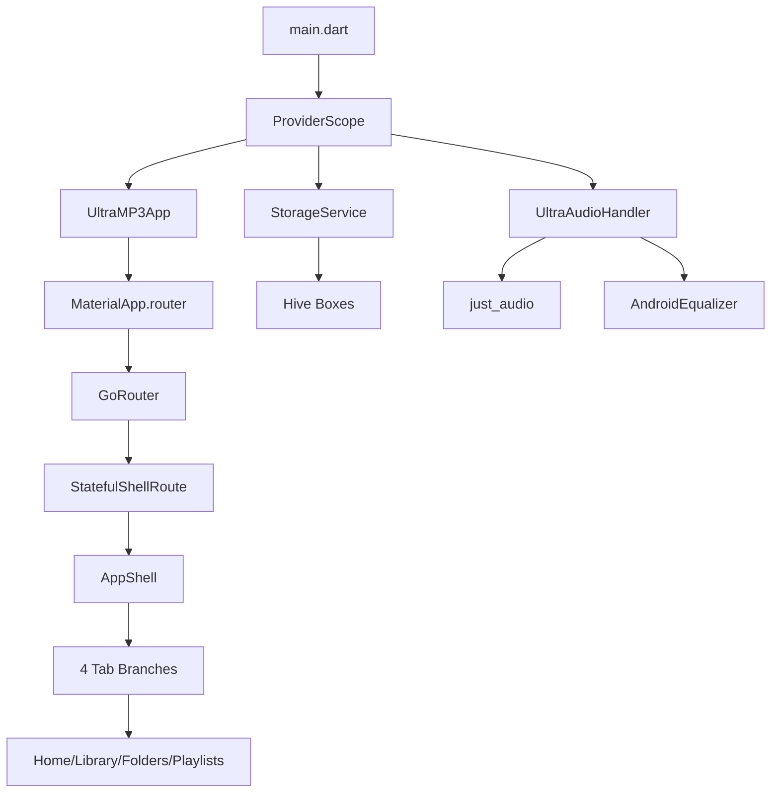

# UltraMP3 Reborn — Technical Design Document

## 1. Project Overview

### 1.1 Purpose and Vision

UltraMP3 Reborn is a modern, high-performance offline music player built with Flutter. The application pays homage to the classic Symbian S60 UltraMP3 experience while incorporating contemporary design elements including cyber-retro aesthetics, glassmorphism, and neon accents. The application operates entirely offline with zero network dependencies, storing all data locally using Hive for persistence and leveraging platform-specific audio APIs for playback.

The target platforms include Android, iOS, Windows, macOS, Linux, and Web, with platform-specific optimizations for each. The application features a sophisticated visualizer engine with 21 distinct styles, a comprehensive equalizer with 14 presets, and a skin system offering 23 unique visual themes spanning skeuomorphic and flat minimalist designs.

### 1.2 Key Features

The application provides a complete music playback experience including library management with song, album, and artist views, folder-based browsing for manual navigation, playlist management supporting favorites, recently played, and custom playlists, and a full-featured player screen with visualizer, equalizer, and skin customization. The audio engine supports background playback with system notification integration, Android native equalizer effects, and simulated audio-reactive visualization.

### 1.3 Design Philosophy

The architecture follows a feature-based modular structure using Riverpod for state management and go_router for declarative navigation. The codebase emphasizes separation of concerns with distinct layers for domain models, presentation, and services. The visual design system centers on a cyber-retro aesthetic with neon green, electric cyan, and cyber pink as primary accent colors against an obsidian dark background.

---

## 2. Technology Stack

### 2.1 Core Framework and Language

The application is built with Flutter 3.2+ using Dart 3.2+ as the programming language. The SDK constraint requires a minimum Dart version of 3.2.0 with an upper bound of 4.0.0, ensuring compatibility with modern Dart features while maintaining stability.

### 2.2 State Management

Riverpod serves as the primary state management solution with three key packages: flutter_riverpod version 2.5.1 provides the core provider functionality, riverpod_annotation version 2.3.3 enables code generation for providers, and riverpod_generator version 2.4.0 generates type-safe providers from annotated functions. The application uses ProviderScope at the root level to manage dependency injection with overrides for StorageService and UltraAudioHandler.

### 2.3 Routing and Navigation

Go_router version 13.2.0 handles declarative routing with support for nested navigation through StatefulShellRoute. The router configuration uses a root navigator key with four main branches corresponding to the bottom navigation tabs. Additional routes exist for the player overlay and player settings, both using parentNavigatorKey to display above the shell.

### 2.4 Audio Engine

The audio subsystem combines three packages: just_audio version 0.9.36 provides the core playback engine with support for multiple audio sources including files, URLs, and assets, audio_service version 0.18.12 handles background audio processing and system notification integration, and audio_session version 0.1.16 manages audio focus and session configuration. The rxdart package version 0.27.7 enables reactive stream combination for position state management.

### 2.5 Media Discovery

Media indexing uses on_audio_query version 2.9.0 on mobile platforms to query the device's media store. Desktop platforms implement a custom recursive directory scanner that probes audio files for duration information using a headless AudioPlayer instance. The permission_handler package version 11.3.0 manages runtime permissions with platform-specific logic for Android 13+ audio permissions versus legacy storage permissions.

### 2.6 Local Storage

Hive Flutter version 1.1.0 provides local offline persistence with five distinct boxes: settings stores application configuration, favorites contains favorite track IDs, recently_played maintains a capped history of played tracks, playlists stores user-created playlists as lists of track IDs, and active_queue preserves the current playback session state.

### 2.7 UI and Visual Design

The Google Fonts package version 6.1.0 provides access to Orbitron, Rajdhani, Outfit, and ShareTechMono fonts for the digital and technical aesthetic. Flutter_svg version 2.0.9 handles vector icon rendering. Custom painters implement the visualizer engine with shader support for advanced effects.

### 2.8 Code Generation

Build tools include build_runner version 2.4.8 for running code generators, riverpod_generator version 2.4.0 for generating providers, freezed version 2.4.7 with freezed_annotation for immutable data classes, hive_generator version 2.0.1 for Hive type adapters, and json_serializable version 6.7.1 for JSON serialization.

---

## 3. Architecture Overview

### 3.1 High-Level Architecture

The application follows a feature-based modular architecture with clear separation between core services and feature modules. The entry point in main.dart initializes the Flutter binding, initializes Hive storage, starts the AudioService with UltraAudioHandler, and runs the application wrapped in ProviderScope with service overrides.



### 3.2 Directory Structure

The lib directory contains the main application code organized into core and features directories. The core directory houses shared services, routing configuration, theming, and reusable widgets. The features directory contains feature modules with their own domain, presentation, and provider layers.

```
lib/
├── main.dart                              # Application entry point
├── core/
│   ├── routing/
│   │   ├── app_router.dart                # GoRouter configuration
│   │   └── routes.dart                    # Route constants
│   ├── services/
│   │   ├── audio_handler.dart             # UltraAudioHandler implementation
│   │   ├── playback_service.dart          # Playback orchestration
│   │   ├── media_query_service.dart       # Media library scanning
│   │   ├── permission_service.dart        # Runtime permissions
│   │   └── storage_service.dart           # Hive persistence
│   ├── theme/
│   │   ├── app_colors.dart                # Color palette definitions
│   │   └── app_theme.dart                 # Theme configuration
│   └── widgets/
│       └── seek_bar.dart                  # Reusable seek slider
└── features/
    ├── splash/                            # Splash screen module
    ├── shell/                             # App shell with bottom nav
    ├── home/                              # Home dashboard
    ├── library/                           # Media library browser
    ├── folder_browser/                    # File system browser
    ├── playlists/                         # Playlist management
    ├── player/                            # Main player with visualizer
    └── settings/                          # Application settings
```

### 3.3 Core Services Layer

The services layer provides cross-cutting functionality through singleton services managed by Riverpod providers. StorageService initializes all five Hive boxes during application startup and provides synchronous getter methods with default values for settings. UltraAudioHandler extends BaseAudioHandler from audio_service and wraps just_audio's AudioPlayer, handling audio focus, notification controls, and Android-specific equalizer integration. PlaybackService acts as the orchestration layer between the UI and audio handler, exposing combined streams for position state and providing high-level operations like playTrack that handle metadata and queue management. MediaQueryService implements platform-specific scanning logic, using on_audio_query on mobile and recursive directory traversal on desktop.

### 3.4 Feature Module Structure

Each feature module follows a consistent structure with presentation screens, providers for state management, and domain models for data definitions. The player module is the most complex with domain models for player skins, presentation providers for settings, multiple screens including the main player and settings, and widgets for reusable components like the mini player.

---

## 4. Data Models

### 4.1 AppTrack

The AppTrack model represents a scanned audio track in the application with fields for id (file path), title, artist, album, filePath, duration, and size. The model includes JSON serialization support through toJson and fromJson factory methods. This model is used throughout the application for track representation and is distinct from audio_service's MediaItem which is used for playback and notification purposes.

### 4.2 ScanStatus

The ScanStatus class tracks media library scanning progress with progress as a double from 0.0 to 1.0, currentPath showing the file being processed, songsIndexed as the count of discovered tracks, and isCompleted as a boolean flag. This model enables real-time progress updates during library scanning.

### 4.3 PositionState

The PositionState model combines playback position and duration for UI display. It is created through Rx.combineLatest3 of position stream, duration stream, and media item, providing a unified state object for the UI to consume.

### 4.4 PlayerSkin

The PlayerSkin class defines the complete visual appearance of the player with 15 color properties for different UI elements, a bgAssetPath for background images, and an isFlat boolean distinguishing skeuomorphic from flat minimalist designs. The class includes 23 static instances spanning 8 skeuomorphic skins inspired by Symbian aesthetics and 15 flat minimalist skins with modern cyberpunk and neon themes.

### 4.5 MediaItem Integration

The audio_service package's MediaItem model represents tracks during playback with id as the file path, album, title, artist, and duration. The application creates MediaItem instances in PlaybackService.playTrack and passes them to UltraAudioHandler.loadQueueItem for playback initialization and notification display.

---

## 5. Key Workflows

### 5.1 Application Startup

The startup sequence begins with WidgetsFlutterBinding.ensureInitialized() to prepare the Flutter framework. StorageService.init() initializes Hive and opens all five boxes. AudioService.init() creates the UltraAudioHandler instance with configuration for the Android notification channel. The ProviderScope wraps the application with overrides for storageServiceProvider and audioHandlerProvider. Finally, runApp launches UltraMP3App which builds the MaterialApp with the GoRouter configuration.

### 5.2 Media Library Scanning

The scanning workflow differs by platform. On Android and iOS, MediaQueryService.getSongs() requests storage permission, queries on_audio_query for all songs with sort and filter options, transforms SongModel instances to AppTrack models with normalized metadata, and emits progress updates through the scanStream. On desktop platforms, the service falls back to recursive directory traversal of the user's Music directory, probes each audio file's duration using a headless AudioPlayer, and applies heuristics for metadata extraction from filenames when tags are unavailable.

### 5.3 Playback Initialization

When a user selects a track, PlaybackService.playTrack() creates a MediaItem with the track's metadata, optionally creates a full queue from the provided list, calls UltraAudioHandler.loadQueueItem() which creates a ConcatenatingAudioSource for queues or a single AudioSource for individual tracks, initiates playback with _handler.play(), records the track in recently_played through StorageService, and persists the queue state including active track and position.

### 5.4 Audio Event Flow

Just_audio emits playback events through its playbackEventStream which UltraAudioHandler transforms to audio_service's PlaybackState format. The transformed state is piped to the playbackState stream. Position updates flow through _player.positionStream while duration comes from _player.durationStream. PlaybackService combines these with Rx.combineLatest3 into PositionState for UI consumption. Media item updates flow through _handler.mediaItem for notification and UI synchronization.

### 5.5 Visualizer Data Flow

On Android, the visualizer data originates from the Android Visualizer native API accessed through a MethodChannel. The _visualizerChannel receives FFT data as Uint8List which _fftToBands transforms into 10 frequency band magnitudes normalized to 0.0-1.0. The _updateBeatPulse method detects rhythmic transients to generate a beat pulse value. On other platforms, the visualizer uses simulated data with synthetic beat energy around 130 BPM.

### 5.6 Equalizer Control

The equalizer workflow begins with setEqualizerBands() receiving gain values for 5 bands. On Android, the method retrieves the native AndroidEqualizer parameters, clamps gains to the valid dB range, applies pre-amplification attenuation to prevent clipping, and ramps smoothly over 300ms using 15 steps of 20ms each. On other platforms, the call is a no-op.

### 5.7 Persistence Operations

Settings persistence uses typed getter and setter methods in StorageService with default values. Favorites toggle adds or removes the track ID from the favorites box. Recently played maintains a capped list at 50 entries by removing duplicates and oldest entries. Playlist operations work with List<String> stored in the playlists box keyed by playlist name. Queue state saves the queue list, active song ID, and playback position for session restoration.

---

## 6. Key Classes and Components

### 6.1 UltraAudioHandler

The UltraAudioHandler class extends BaseAudioHandler and mixes in QueueHandler and SeekHandler. It wraps just_audio's AudioPlayer and provides Android-specific features including AndroidEqualizer for native equalizer effects, virtualizer for stereo widening, and visualizer for FFT data. Key methods include loadQueueItem() for queue and track loading, setEqualizerBands() for equalizer control, and _fftToBands() for frequency analysis. Key streams include visualizerBandsStream for frequency data and volumeStream for volume changes.

### 6.2 PlaybackService

The PlaybackService class provides the high-level API for playback operations. It exposes currentMediaItemStream, playbackStateStream, and positionStateStream for UI binding. The playTrack() method handles complete track initialization with metadata and queue support. Additional methods delegate to the audio handler for play, pause, seek, stop, skip, equalizer, and volume control.

### 6.3 StorageService

The StorageService class manages all Hive operations through five boxes. Settings methods provide type-safe access with default values. Favorites and recently played use simple ID-based storage. Playlists support CRUD operations on lists of track IDs. Queue persistence saves and restores playback session state.

### 6.4 MediaQueryService

The MediaQueryService class implements platform-specific media discovery. On mobile, it delegates to on_audio_query for media store access. On desktop, it implements recursive directory scanning with AudioPlayer-based duration probing. The scanStream broadcasts progress updates during scanning operations.

### 6.5 AppShell

The AppShell widget implements the bottom navigation shell using StatefulShellRoute. It displays a Scaffold with BottomNavigationBar for the four main tabs and shows the MiniPlayer when a track is loaded. The navigation shell maintains tab state during navigation.

### 6.6 PlayerScreen

The PlayerScreen is the application's most complex widget at approximately 6,647 lines. It contains the visualizer engine with 21 styles and multiple variations, dial controls with circular, rectangular, and digital toggle styles, equalizer UI with 5-band control and 14 presets, skin application with 23 theme options, queue display, track info marquee, and responsive layout for portrait and landscape orientations.

---

## 7. Routing Structure

### 7.1 Route Hierarchy

The routing configuration uses a hierarchical structure with the splash screen as the initial route. The StatefulShellRoute creates four branches for the bottom navigation tabs, each containing a single route. Additional routes for player overlay and player settings use parentNavigatorKey to display above the shell.

```mermaid
graph TD
    A[/splash] --> B[StatefulShellRoute]
    B --> C[Branch 1: /home → PlayerScreen]
    B --> D[Branch 2: /library → LibraryScreen]
    B --> E[Branch 3: /folders → FolderBrowserScreen]
    B --> F[Branch 4: /playlists → PlaylistsScreen]
    G[/player] --> H[PlayerScreen overlay]
    I[/player-settings] --> J[PlayerSettingsScreen]
```

### 7.2 Route Constants

The AppRoutes class defines route path constants: splash is "/splash", home is "/home", library is "/library", folders is "/folders", playlists is "/playlists", and player is "/player". The home route currently points to PlayerScreen instead of HomeScreen, which is a known routing issue.

### 7.3 Transition Animations

The player route uses a CustomTransitionPage with a slide-up animation from offset (0.0, 1.0) to (0.0, 0.0) using the easeInOutCubic curve. This creates the slide-up now-playing overlay effect.

---

## 8. Theme System

### 8.1 Color Palette

The AppColors class defines the cyber-retro color palette with voidBlack as #0A0A0F for the background, obsidianDark as #12121A for surfaces, neonGreen as #39FF14 for primary accents, electricCyan as #00E5FF for secondary accents, cyberPink as #FF0055 for tertiary accents, textPrimary as #ECEFF4 for main text, and textSecondary as #81A1C1 for muted text.

### 8.2 Theme Configuration

AppTheme.darkTheme configures Material3 with the dark color scheme, custom text themes using Google Fonts (Orbitron for displays, Rajdhani for labels, Outfit for body text), custom slider theming with cyan accents, bottom navigation bar theming with green selected items, and theme extensions for glassmorphism effects and neon glows.

### 8.3 Theme Extensions

AppThemeExtension provides custom theme properties including glassBgColor and glassBorderColor for glassmorphic elements, greenGlow, cyanGlow, and pinkGlow as lists of BoxShadow for neon effects, digitalClockStyle for the large clock display, and trackTitleStyle for marquee text.

---

## 9. Visualizer System

### 9.1 Visualizer Styles

The application implements 21 visualizer styles with multiple variations each: spectrumBars, waveform, circularSpectrum, particleReactive, liquidFluid, breathingRings, retroWinamp, albumArtReactive, combinedUltra, solarFlares, vortexOrbit, rippleWaves, particleWaveFlow, cosmicTunnel, orbitalGlow, frequencyLaser, dnaHelix, audioMatrixGrid, and blackHoleStars. Each style has 3-4 variations resulting in approximately 70 distinct visual modes.

### 9.2 Visualizer Architecture

The visualizer system uses a custom painter (_VisualizerPainter) of approximately 1,500 lines that renders the visual representation based on the selected style and variation. The painter receives 10 amplitude bands from the FFT analysis and a beat pulse value for rhythmic effects. The system simulates beat energy at approximately 130 BPM with kick and snare patterns.

### 9.3 FFT Processing

On Android, FFT data comes from the native Visualizer API through a MethodChannel. The _fftToBands method converts the interleaved real/imaginary byte format to 10 frequency band magnitudes, normalizing each to a 0.0-1.0 range. The _updateBeatPulse method applies exponential moving average smoothing and transient detection for beat pulse generation.

---

## 10. Skin System

### 10.1 Skin Categories

The 23 skins divide into two categories. Skeuomorphic skins (8 total) include S60 Classic Grey, Symbian Classic Blue, Obsidian Void, Matrix Amber, Ferrari Special Edition, Neon Aurora Green, Desert Horizon Gold, and Glacier Crystalline Ice. These skins feature metallic gradients, reflective LCD backgrounds, and tactile button appearances. Flat Minimal skins (15 total) include Cyberpunk, Mint Forest, Peach Blossom, Dark Monochrome, Amethyst Violet, Amber Sunset, Polar Cyan, Neon Sunset, Sakura Pastel, Glassmorphic, Lo-Fi Rain, Minimal Techno, Vinyl Noir, Pastel Lavender, and Sakura Light. These skins feature solid colors, minimal gradients, and modern neon accents.

### 10.2 Skin Properties

Each PlayerSkin defines outerBorderColor for the player frame, panelBgColor for the main background, metallicGradients for skeuomorphic surfaces, lcdBgColor and lcdBorderColor for the display area, textColor and textMutedColor for text, visualizerColor and visualizerPeakColor for frequency display, buttonFaceColor and buttonIconColor for controls, statusLedColor for indicator LEDs, bgAssetPath for background images, and isFlat to distinguish categories.

### 10.3 Skin Persistence

The active skin is stored in Hive under the "active_skin" key with default value "Symbian Classic Blue". The skin type (classic/flat) is stored separately under "skin_type". When the player loads, it retrieves these values and applies the corresponding PlayerSkin instance.

---

## 11. Equalizer System

### 11.1 Equalizer Configuration

The equalizer provides 5 bands with gain range of -12 dB to +12 dB. The system includes 14 presets: Flat, Rock, Pop, Jazz, Bass & Treble, Mids, Classic, Live, Dance, Soft, No Bass, No Mids, No Treble, and Custom. The current preset and band gains persist to Hive.

### 11.2 Android Native Equalizer

On Android, the application uses AndroidEqualizer from just_audio for native equalizer effects. The setEqualizerBands method retrieves the native parameters, applies smooth ramping over 300ms to prevent audio artifacts, and applies pre-amplification attenuation when boosts are applied to prevent clipping.

### 11.3 Equalizer Persistence

Equalizer settings persist through StorageService methods: getEqualizerPreset() and setEqualizerPreset() for the active preset, getEqualizerBands() and setEqualizerBands() for the 5 band values, and getVolumeLevel() for the master volume.

---

## 12. Known Issues and Technical Debt

### 12.1 Routing Issues

The HomeScreen implementation exists at lib/features/home/presentation/screens/home_screen.dart but the /home route in app_router.dart points to PlayerScreen instead. This creates confusion about the intended dashboard experience. The SettingsScreen exists but has no route entry, making it unreachable from the UI.

### 12.2 Simulated Features

Several features use simulated data rather than real implementations. The visualizer beat detection uses synthetic beat energy at 130 BPM rather than real FFT analysis. The "Recently Added" smart playlist uses physicalSongs.take(20) instead of file timestamps. The "Most Played" smart playlist uses the recently played list or arbitrary slice rather than actual play counts.

### 12.3 Hardcoded Values

The desktop scanning uses a 240-second default duration when probing fails. Folder playback uses hardcoded metadata with artist "FOLDER AUDIO". Desktop scans use placeholder metadata with artist "LOCAL DRIVE" and inferred album from parent directory. The Android initial folder is hardcoded to /storage/emulated/0.

### 12.4 Code Quality Issues

The PlayerScreen widget exceeds 6,600 lines making it difficult to test and maintain. Static analysis reports approximately 467 issues including deprecated withOpacity usage, unused locals and elements, missing const qualifiers, and style inconsistencies. Production code uses print statements for logging rather than a structured logging system. Hive storage uses raw string keys without type adapters despite having hive_generator in dependencies.

### 12.5 Testing Gap

The test directory contains only a single widget smoke test for SplashScreen rendering. There are no unit tests for services, providers, or models, creating risk for refactoring and bug fixes.

---

## 13. Platform-Specific Implementations

### 13.1 Android

Android-specific features include AndroidEqualizer for native equalizer effects, Android Visualizer for FFT data through MethodChannel, audio_service foreground notification with custom channel configuration, Permission.audio for Android 13+ with fallback to Permission.storage for older versions, and Virtualizer effect for stereo widening.

### 13.2 iOS

iOS uses on_audio_query for media library access with UriType.EXTERNAL. The application relies on iOS audio session configuration through audio_session. Background audio requires proper Info.plist configuration.

### 13.3 Desktop Platforms

Desktop platforms (Windows, macOS, Linux) implement custom media discovery through recursive directory scanning of the Music folder. Duration probing uses a headless AudioPlayer instance to read file metadata. Permissions always return true on desktop with no permission requests.

### 13.4 Web

The web platform uses the same audio engine but may have limitations with background audio and file system access. The application should function but some features like folder browsing may have reduced capability.

---

## 14. Dependencies Analysis

### 14.1 Core Dependencies

The essential dependencies for application functionality are flutter for the framework, flutter_riverpod for state management, go_router for routing, just_audio and audio_service for audio playback, on_audio_query for mobile media discovery, hive_flutter for persistence, and google_fonts for typography.

### 14.2 Development Dependencies

Development and build dependencies include flutter_test for testing, build_runner for code generation, riverpod_generator for provider generation, freezed for immutable classes, hive_generator for Hive adapters, and flutter_launcher_icons for icon generation.

### 14.3 Unused or Underused Dependencies

The project includes freezed and freezed_annotation but does not appear to use frozen data classes extensively. The hive_generator dependency is present but no type adapters are generated. The shaders directory contains shader files but their integration status is unclear.

---

## 15. Codebase Mind Map

```
UltraMP3 Reborn
├── Entry Point
│   └── main.dart (initializes services, runs app)
├── Core Layer
│   ├── Services
│   │   ├── audio_handler.dart (UltraAudioHandler - audio engine bridge)
│   │   ├── playback_service.dart (orchestration, streams)
│   │   ├── media_query_service.dart (library scanning)
│   │   ├── storage_service.dart (Hive persistence)
│   │   └── permission_service.dart (runtime permissions)
│   ├── Routing
│   │   ├── app_router.dart (GoRouter config, StatefulShellRoute)
│   │   └── routes.dart (route constants)
│   ├── Theme
│   │   ├── app_colors.dart (color palette)
│   │   └── app_theme.dart (ThemeData, extensions)
│   └── Widgets
│       └── seek_bar.dart (reusable component)
├── Features Layer
│   ├── splash (animated boot screen)
│   ├── shell (bottom nav, app shell)
│   ├── home (dashboard - implemented but not routed)
│   ├── library (songs/albums/artists tabs)
│   ├── folder_browser (file system navigation)
│   ├── playlists (favorites, recents, custom playlists)
│   ├── player (main player, visualizer, EQ, skins)
│   └── settings (app settings - implemented but not routed)
└── Assets
    ├── images/ (10 background images for skins)
    ├── icons/ (app icons)
    └── shaders/ (GLSL shader files)
```

---

## 16. Security and Performance Considerations

### 16.1 Security

The application operates entirely offline with no network requests, eliminating network attack surfaces. File access is limited to user-selected music directories. The Android audio session is properly configured with notification channel setup. No sensitive data is logged except through debug print statements.

### 16.2 Performance

The visualizer system uses CustomPainter for efficient rendering. Hive provides fast local storage with all boxes opened in memory. The desktop scanner probes durations sequentially which may be slow for large libraries. The PlayerScreen's large size may impact widget rebuild performance.

### 16.3 Memory

Hive boxes are opened in memory for fast access. The recently played list is capped at 50 entries. Audio files are not loaded into memory, only their paths. Visualizer FFT data is processed in real-time without caching.

---

## 17. Conclusion

UltraMP3 Reborn is a well-architected Flutter application with clear separation of concerns, appropriate use of Riverpod for state management, and a comprehensive feature set for music playback. The codebase shows attention to visual design with the cyber-retro aesthetic and extensive skin system. Key areas for improvement include routing fixes to connect implemented screens, reduction of PlayerScreen complexity through modularization, addition of unit tests for services and providers, replacement of print statements with structured logging, and implementation of simulated features with real data sources.